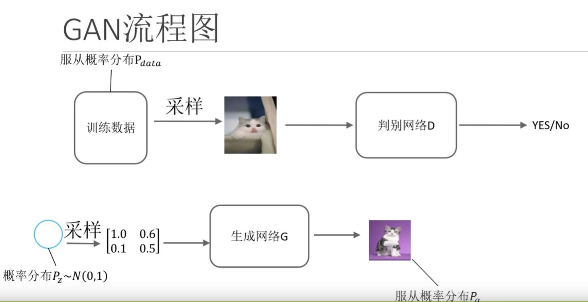
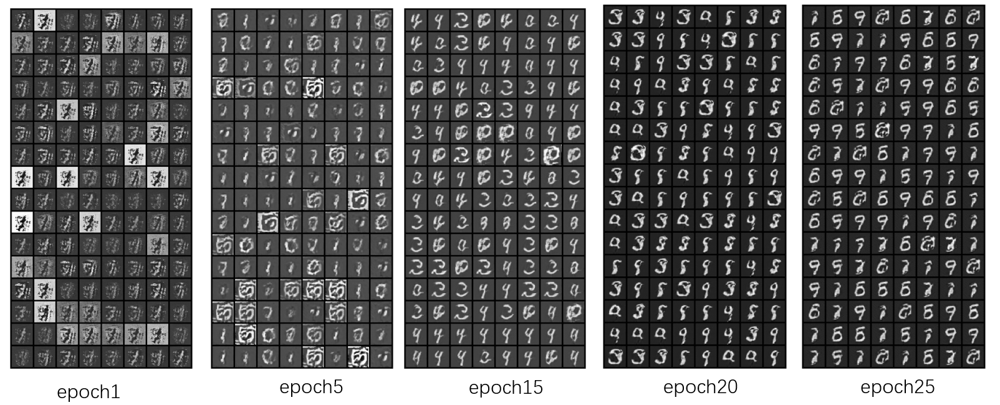
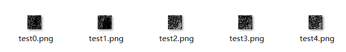
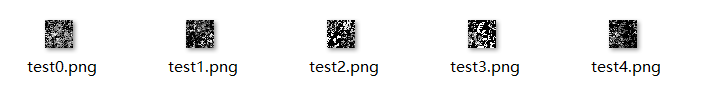
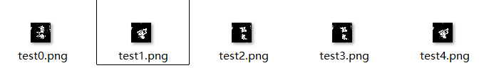
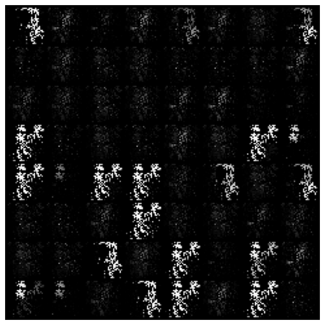
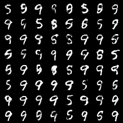

近年来，生成对抗网络（GAN, Generative Adversarial Network）成为了生成模型中的一颗明星。它由 Ian Goodfellow 等人于 2014 年提出，凭借其结构简单但效果惊艳的特点，在图像、语音、文本等多个领域都取得了突破性成果。（看到好多人说GAN是深度学习领域看到过的最惊艳的想法（））

最近，我动手实现了一个简单的 GAN，并成功使其在经典的手写数字数据集 MNIST 上收敛，最终可以生成逼真的手写数字图像。本文将介绍我的实验过程与一些经验。

## 1. GAN 简介

GAN 包含两个核心部分：

- **生成器 G**：输入一段随机噪声，输出一张图像，目标是“骗过”判别器；
- **判别器 D**：输入一张图像，判断其是真实样本还是生成样本。

G 和 D 相互对抗，G 不断学习如何生成更加真实的图像，D 不断提高识别真假图像的能力，最终达到一个动态平衡。

------

## 2. 模型结构设计

1. 我的生成器 G 采用了多层全连接神经网络，并使用了 `LeakyReLU` 激活函数、`BatchNorm1d` 正则化以及 `Dropout` 层来增强训练稳定性。最终输出通过 `sigmoid` 激活，形状为 `(1, 28, 28)`，对应 MNIST 图像尺寸。模型保存权重大小为40MB左右。

​		判别器 D 使用了两个 `Conv2d` 层提取图像特征，接着是一个全连接层输出二分类结果，同样加入了 `Dropout` 进行防过拟合处理，也是为了减缓训练速度。

​		模型保存权重大小仅5.35KB。

2. 参考的文章中，使用更小的多层全连接神经网络，并使用了 `LeakyReLU` 激活函数、`BatchNorm1d` 正则化以及 `Dropout` 层，模型保存权重大小仅1MB左右

   判别器使用多层卷积提取特征，然后多层全连接进行分类，使用了 `LeakyReLU` 激活函数、`BatchNorm1d` 正则化，无dropout，模型保存权重大小为40MB左右

但结果是参考的文章中的训练效果和收敛速度均好于我的，仍然不知道为什么。可能是深层的判别器收敛更慢？我自己的模型遇到的问题是判别器收敛过快，导致生成器跟不上。

------

## 3. 训练技巧与调参经验

训练 GAN 并不容易，因为模型非常不稳定。我在训练中采用了一些技巧：

- **标签平滑**：将真实标签设为 **0.9 ~ 1的随机数**而非 1，可以缓解判别器过强的问题。而且使**y = sigmod(x)**中的**x**不至于太靠近数轴两侧，导致梯度消失。
- **随机交换标签**：在训练早期加入一定概率的真假标签交换，减缓判别器的学习速度。一定的随机性有助于训练
- **Dropout**：避免判别器过早收敛。
- **优化器**：使用 `Adam` 优化器，学习率设为 `1e-4`，权重衰减较小或为零。
- **损失函数**：一开始使用均方误差MSE，后来发现使用交叉熵损失 `BCELoss`收敛更快。

最终，在大约 50 个 epoch 后，模型成功生成出类似真实手写数字的图像。

------

## 4. 可视化成果

我将每轮生成的 64 张图像拼成一张大图并保存下来，观察模型的收敛过程非常直观。训练初期图像像噪声，但逐渐开始有结构，最后清晰可见数字轮廓。

------

## 5. 一些反思

- GAN 的不稳定性是真实存在的，尤其是 D 学太快（实际上是我的D太浅了，过拟合了）会导致 G 无法学习；
- 使用深层的D很重要，不然无法进行有泛化性的分类；
- 调参的过程极其关键，尤其是损失函数、学习率、Dropout 的选择（煎熬，这就是黑箱，自己对模型的感觉还不到位）；
- 实验的每一次训练结果都可能不同，种子控制（没有使用）与实验可复现性也很重要。

## 参考文章：

1. https://blog.csdn.net/starvapour/article/details/115134327?fromshare=blogdetail&sharetype=blogdetail&sharerId=115134327&sharerefer=PC&sharesource=m0_74167177&sharefrom=from_link
2. https://oldpan.blog.csdn.net/article/details/78711426?fromshare=blogdetail&sharetype=blogdetail&sharerId=78711426&sharerefer=PC&sharesource=m0_74167177&sharefrom=from_link

## 迭代改进过程：

## v1:

1. 数据集同时使用MNIST数据集和G.gteImage(),每次根据索引取出一张，然后由datasetloader每次取batchsize次，G.forward()无法并行，导致取数据漫

2. G全卷积层，初始随机传入一个大的x数组，可能占内存大
3. 损失函数使用均方误差
4. D和G训练比1：200

训练过慢，无法实用

## v2：

1. 数据集只用MNIST，batch下取数据快
2. G两层全连接＋一层卷积
3. 使用手写的交叉熵损失
4. D和G训练比 1：300

训练速度还好，D损失下降快，训练充分；G训练不出来，输出的随机图片：

## v3.0：

总结问题：

1. D 收敛得太快，直接就把 G 生成的图片看穿了，D最后一层的激活函数为sigmod，训练太好导致每次返回（在sigmod的左右两侧）梯度消失
2. 让 D **不要太自信**，反而有助于 G 的训练

解决：

1. 减少D的网络层数，增加G网络层数，使用假标签（**真实标签为 1** 的地方改成 **0.9**，**假标签 0** 改为 **0.1**），防止sigmod梯度消失
2. 加入假标签，减慢训练D的能力
3. D和G训练比 1：10

G训练失败，输出无规律：

## v3.1：

1. lossG使用 BCEWithLogitsLoss 计算损失
2. D和G训练比 1：30

G训练失败，输出无规律

## v3.2：

1. lossG和lossD使用 BCEloss计算损失
2. D和G训练比 1：1
3. 加入标签交换

G训练失败，输出无规律

## v3.2_

1. D和G训练比 1：5
2. 增加很多优化器参数：optim.Adam(G.parameters(), 1e-4, betas=(0.5, 0.999), weight_decay=1e-4)

3. 标签交换：交换率逐渐下降，超过epoch/2后不交换

有了一些稍微能看的输出：

但后面还是不向好的方向收敛

## v4.0

1. 训练比1：1

2. 改写G的网络，加入nn.LeakyReLU和dropout

   

   。。。

## v4.1

1. 改写D的网络，加入dropout

## v5.0

1. 使用其他人的G和D模型
2. 训练比1：1

别人的模型就是好用，10epoch就这样了

